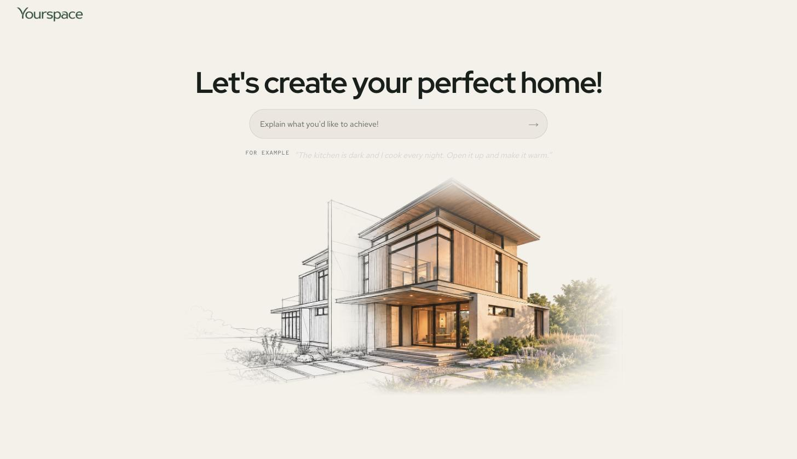
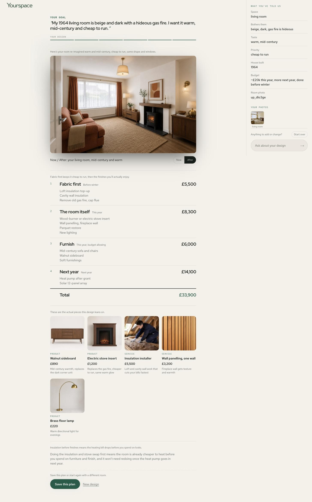

# Yourspace

A home design service that builds its own screens. You tell it what you want to change about
your house, it asks one question at a time, then it renders your actual room from a photo and
prices the work.

Built in one day at the Architect x Corgi designathon on generative UI (6 September 2026).
It runs live at **https://hearth-sage-pi.vercel.app**.



## What it does

1. You type a goal in your own words. "My 1964 living room is beige and dark with a hideous gas
   fire. I want it warm, mid-century and cheap to run."
2. It interviews you. One question per screen, each one reacting to your last answer. The
   questions come from the goal: a room redesign asks about the space, what bothers you, taste and
   budget. A solar or energy goal asks about the roof, heating and usage instead, and never
   about taste.
3. It asks for a photo of the room.
4. It shows the room re-imagined in the style you described, a staged plan with costs, the actual
   products and trades the design leans on (with generated product images), one recommendation
   and one next step. Everything you have told it sits in a panel on the right, and you can keep
   asking. "Less orange, more timber" swaps the render and nothing else on the screen moves.



## The idea underneath

Most generative UI lets the model draw the screen. That drifts. It invents spacing and colour and
produces a different-looking thing every run.

Here the model never touches appearance. It emits a small JSON plan (a `UIPlan`) that says what is
on the screen, why each block is there and how much it matters. A renderer I designed once
resolves everything visual. The brand is not a prompt instruction, it is a schema constraint.
There is no field for colour.

```json
{
  "intent": "Your living room, warm and mid-century",
  "frame": "focus",
  "blocks": [
    { "id": "render.living_room", "component": "render.compare", "intent_class": "data-display",
      "tier": "hero", "why": "Your room, from your photo, in the warmth you described",
      "props": { "scene": "up_dlo3ge", "brief": "…", "caption": "Walnut, parquet, the gas fire gone" } },
    { "id": "plan.stages", "component": "plan.stages", "intent_class": "data-display",
      "tier": "primary", "why": "Fabric first, then the finishes you will actually enjoy",
      "props": { "stages": [ … ] } },
    { "id": "action.save", "component": "action.cta", "intent_class": "action",
      "tier": "ambient", "why": "Keep this and pick it up any time",
      "props": { "label": "Save this plan" } }
  ],
  "primary_action": { "block_id": "action.save", "label": "Save this plan" },
  "memory": [ { "label": "Space", "value": "living room" }, { "label": "Budget", "value": "~£20k this year" } ],
  "progress": { "done": 6, "total": 6, "label": "Your design" }
}
```

The pieces:

- **A closed vocabulary.** 13 components, 12 of them published to the model. Each one documents
  what it is for, when not to use it and what to use instead. `web/lib/vocabulary.ts` is read by
  the validator, the prompt and the renderer, so the three cannot disagree.
- **Mechanical rules.** Every plan is validated before it renders. At most five blocks, exactly one
  hero, semantic block ids, a one-line reason per block, one question per turn, no appearance
  words in props, no block moving more than one tier between turns. A plan that fails is sent
  back to the model with the error attached, once, then a hand-written plan takes over. The full
  list is in `RULES.md`.
- **A tier ladder.** Hero, primary, supporting, ambient. The model picks a tier. The renderer
  decides what a tier looks like.
- **Stability across turns.** Blocks are diffed by id. Unchanged blocks do not move. This is the
  part I think most generative UI demos get wrong, and it is where most of the day went.
- **The model never does arithmetic.** Stage costs are summed by the renderer.

Plans come from Claude (`claude-sonnet-5`, structured output) and images from `gpt-image-2`: the
render edits your photo with the model's brief, and each product card generates its own picture.

## Run it locally

```
cd web
npm install
cp .env.local.example .env.local   # ANTHROPIC_API_KEY for plans, OPENAI_API_KEY for images
npm run dev
```

Without an Anthropic key it runs on the hand-written plans in `web/lib/fixtures.ts`. Without an
OpenAI key the render and product image calls return an error and the rest of the screen still
renders. Validate a plan on its own with
`node validate.mjs examples/good.json`.

## Repo layout

| Path | What it is |
|---|---|
| `web/` | The Next.js app. See `web/README.md` for the file map. |
| `RULES.md` | The rule set, 24 mechanical and 5 judgment, numbered. |
| `spec/ui-plan.schema.json` | The contract the model emits. JSON Schema 2020-12. |
| `spec/vocabulary.md` | The component vocabulary, generated from the app. |
| `spec/stability.md` | Diffing and persistence rules across turns. |
| `validate.mjs` | Dependency-free validator for a plan on disk. |
| `examples/` | A good plan, a bad one, and an invalid second turn. |
| `docs/` | Screenshots used on this page. |
| `DEMO.md`, `PLAN.md`, `DESIGN-BRIEF.md`, `research/` | Planning from the day. The last three describe the energy supplier idea I started with, kept for the record. |

## How the day went

The rules and the validator were written before the event. On the day the first domain was a
fictional energy supplier: meter readings, solar suitability, tariff switching. Around lunchtime
a judge told me to push for something more unique, so it became a home design service. The rule
set survived the pivot untouched, which was the point of writing it first.

I directed and Claude Code built. Seven rounds of feedback, each one deployed to Vercel within
minutes.

## Credits

The structural half (intent classes, published and unpublished components, mechanical versus
judgment rules, "when not to use this") is adapted from Liam Cresswell's Subplane work, which
solves the same problem at build time: https://www.youtube.com/watch?v=aAO0b21CZNA. The runtime
half (tiers, scarcity, stability, trust) is mine.
